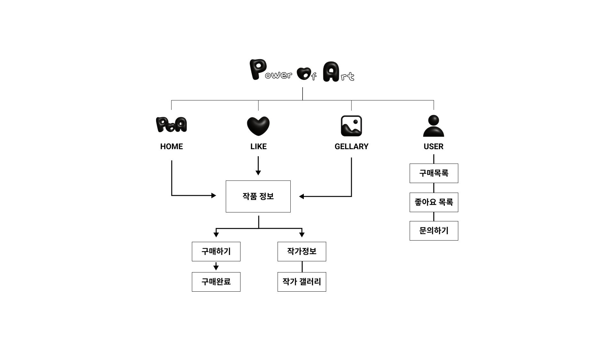
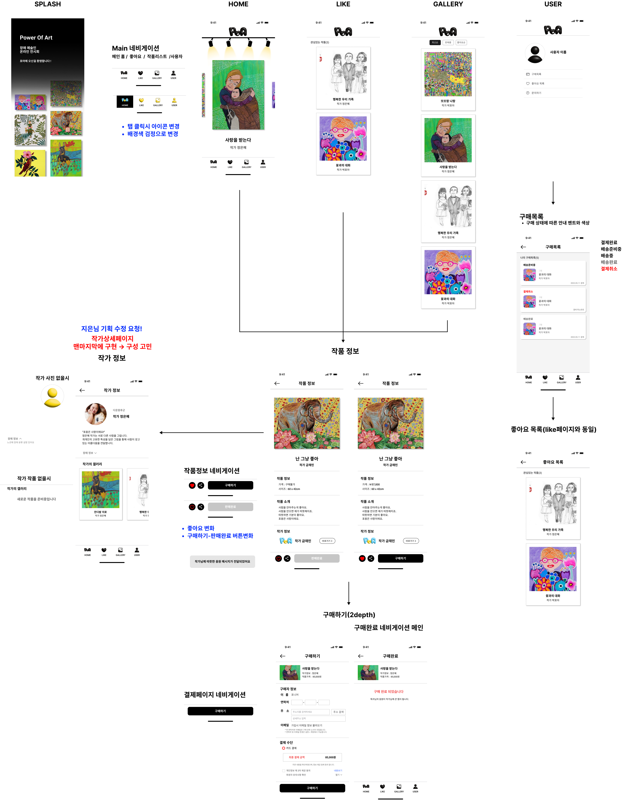
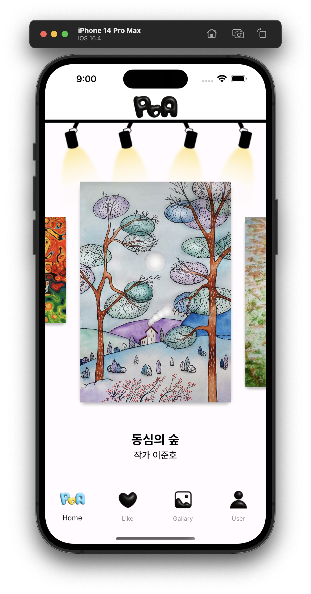
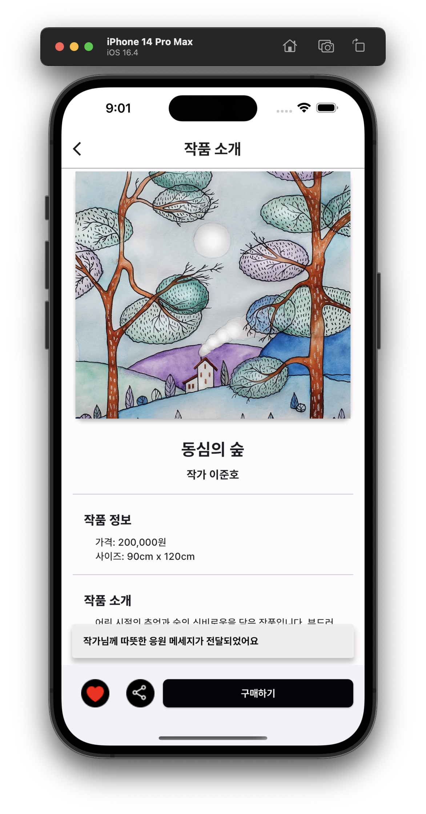
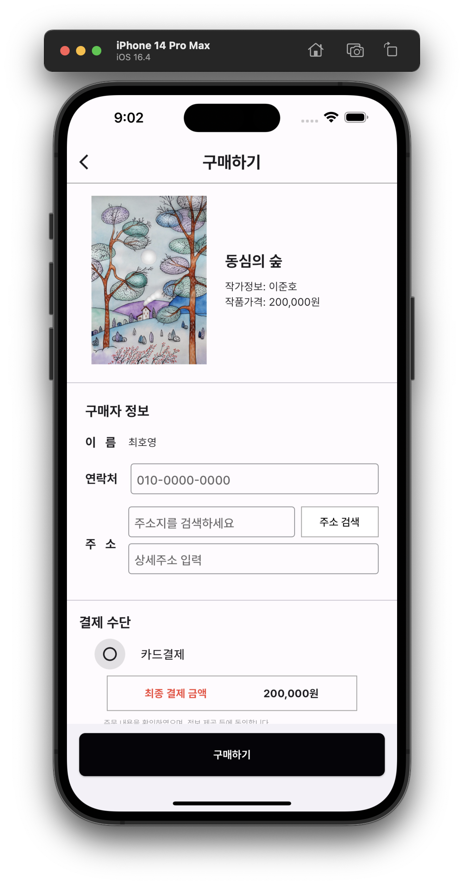
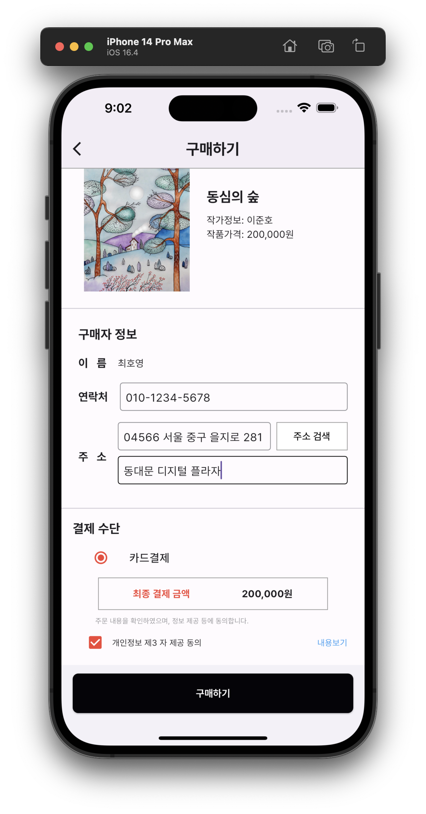
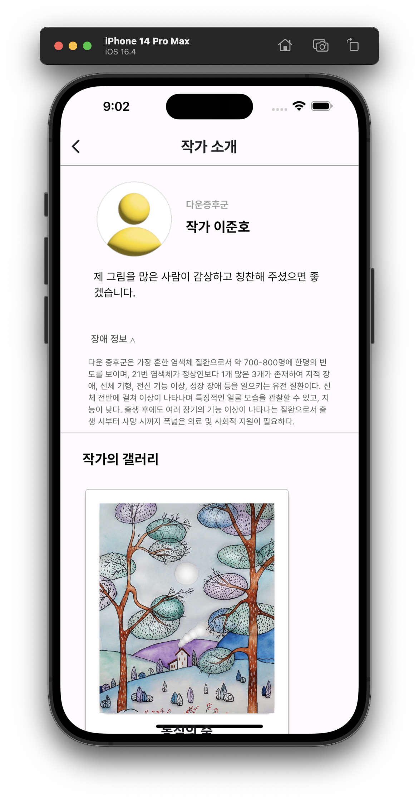

# POA (Power Of Arts)

## 1. 개발 주제
`작가 인터뷰`  
성황리에 종영한 드라마 '우리들의 블루스' 에 대해 아시나요?
극 중 주인공의 쌍둥이 언니로 출연해 화제를 모은 배우 겸 발달장애인 화가 정은혜 작가님이 얼마 전 초대전을 진행했습니다.

대중들은 정은혜 작가의 순수하고 따뜻한 그림을 통해 치유와 공감을 느꼈다고 말했는데요,

정은혜 작가 외에도 여러 장애 예술인이 활발히 작품 활동을 진행하고 있었습니다.

우리는 이들의 인터뷰 기사를 통해 예술 활동은 장애인의 정서적 안정감과 자존감에 긍정적인 영향을 준다는 것을 알게 되었습니다.   

`네티즌 반응`  
'들여다보고 있으면 결국 빙긋이 미소가 나와요.'  
'꾸밈없는 그림에 위로가 됩니다'  
'개개인의 표정과 특징을 보고, 우리는 모두 다르다는걸 깨달았어요.' 등등

순수하고 따뜻한 작품으로, 많은 이들에게 치유와 공감을 전해준 사례.
**감동을 전해주는 장애 작가님들은 지금 어디에 계실까?**

[출처 : 기사](https://www.asiae.co.kr/article/2022091316552265768)

  

## 2. 사회적 배경
서울시 인구의 약 4%는 장애를 갖고 있다는 사실. 알고 계셨나요?

서울시는 사회적으로 취약한 장애인을 위한 다양한 행정적 지원을 펼치고 있는데요, 장애 예술인도 예외는 아니었습니다. 서울시는 매년 다양한 행정적 지원을 통해 장애 예술인이 경제적으로 독립할 수 있는 방법을 모색하고 있었습니다.

그렇다면 장애 예술인들은 이 상황을 어떻게 느끼고 있었을까요?

  

## 3. 프로젝트의 필요성
새싹마을 방범대는 여러 조사 자료를 통해 이들의 문제를 두 가지로 정의했습니다.  
**경제적인 어려움**과 **적절한 홍보 인프라의 부족**이죠.
작품에 대한 홍보 지원이 필요하다고 답한 장애 예술인이 80%를 넘었고, 경제적 어려움을 겪고 있다고 답한 장애 예술인은 70% 이상 이었습니다.
한 인터뷰에서는 장애 예술인의 작품을 시민들에게 보여줄 수 있는 기회가 더 많이 필요하다고 말하고 있었습니다.
 
우리는 이들에게 자신의 작품을 홍보하고, 수익을 창출할 수 있는 플랫폼이 필요하다는 것에 조명했고, 해결 방법을 강구하던 중 두 가지 기회를 발견했습니다.   
첫째는, 추구하는 가치나 신념에 부합하는 제품을 구매하는 **요즘 세대들의 가치소비 트렌드 확산**

둘째는, 시공간의 제약 없이 콘텐츠의 빠른 공유가 가능한 **온라인 전시의 보편화 입니다.**

이곳에서 인사이트를 얻어 **장애 예술인 온라인 전시 플랫폼 포아**가 탄생했습니다.  

  

## 4. 서비스 분석 및 목표
### 1) 서비스명: POA(Power Of Arts)
**power of arts** 의 앞글자를 이어붙인 포아는 **예술의 힘으로 장애 예술인과 독자를 잇겠다는 포부**를 담고 있습니다.   
### 2) 서비스슬로건:
포아는 오프라인 전시회를 그대로 **온라인으로 옮겨온 서비스** 입니다. 최소한의 오프라인 관람 경험을 제공할 수 있는지를 고려하여 MVP 를 설정했습니다.   
### 3) 서비스 목표: 
장애 작가님의 사회적 입지와 경제적 자립을 돕고, 후원자에겐 펀딩의 가치를 불어 넣어주는 것  
`HOW?` 포아가 제안하는 솔루션   
`주요 사용자와 사용자 가치`
- 작가: 장애를 갖고 있는 창작가
①장애작가님들이 자신의 작품 세계를 자유로이 공유하고
②펀딩을 통해 창작 독려금을 모을 수 있으며
③독자들로부터 이해와 공감의 힘을 얻고, 작가로서의 자부심으로 자존감을 높일 수 있음
 
-  독자: 소비로 가치를 표현하는 MZ세대 (가치소비)
①작가 소개 글을 통해 취약계층에 대해 편견 없이 공감하고
②작품을 감상하고 응원할 수 있으며
③타인에게 도움이 된다는 보람과 더불어 가치소비를 실현할 수 있음
 
`가치소비란?`
가치소비는 남을 의식하는 과시소비와는 다르게 실용적이고 자기만족적인 성격이 강하며, 무조건 아끼는 알뜰소비와 달리 무조건 저렴한 상품이 아닌 가격 대비 만족도가 높은 제품에 대해서는 과감한 투자를 행합니다.이제 더 이상 소비자들은 아무리 좋은 퀄리티의 제품과 서비스를 제공한다고 해도 기업에 대한 신뢰를 잃거나, 해당 기업의 이념이 자신과 맞지 않다고 느끼면 소비할 가치를 느끼지 못하고 떠나기 때문입니다.  
[소비자평가](http://www.iconsumer.or.kr)

  

## 5. 우리의 서비스 플로우
### 1) 워크플로우

  

### 2) 디자인

  

## 6. 우리의 서비스 개발 원칙
1. **MVP 개발 단계**
    - 회원가입 & 로그인
    - 메인페이지
    - 구독, 찜 메뉴
    
2. **고도화**
    - 신고하기
    - 채팅
    - 작품 등록
    - 작가 등록
    - 카테고리 검색
    - 푸시 메시지
    - 작품 구매

  

## 7. 서비스 이미지

### 1) POA Main

### 2) POA Arts

### 3) POA Buy Process

### 4) POA Creator

